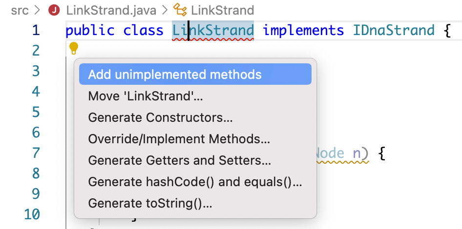

# Project 3: DNA

This is the directions document for Project 3 DNA in CompSci 201 at Duke University, Fall 2023.

**See [the details document](docs/details.md) for information** on using Git, starting the project, and more details about the project including information about the classes and concepts that are outlined briefly below. You'll absolutely need to read the information in the [details document](docs/details.md) to understand how the classes in this project work independently and together. The _details_ document also contains project-specific details, this document provides a high-level overview of the assignment.

## Overview

Here's a high-level view of the assignment. This is enough information to know what to do, but not necessarily how to do it. For details, you can **refer to sections in [the details document](docs/details.md)**.

You'll be developing `LinkStrand`, an implementation of the `IDnaStrand` interface that uses an internal linked list to model recombinant DNA. Your implementation will be much more efficient for modeling DNA splicing operations than using a `String` or `StringBuilde` as you will see/demonstrate in your empirical timing benchmarks.

Here are the major parts of the assignment.
1. In [Part 1](#part-1-running-dnabenchmark-profiling-analysis) you will run the benchmarking program before you write code as part of answering questions in the analysis section.
2. In [Part 2](#part-2-programming) You will create a new class `LinkStrand` that implements the `IDnaStrand` interface. It will utilize a singly linked-list to store the strand information rather than a `String` or `StringBuilder`.
	1. You'll create an inner `Node` class with instance variables `myFirst` and `myLast` and you'll then implement all the methods in the `IDnaStrand` interface, _**testing them using supplied JUnit tests.**_ 
	2. When you create the class and edit it so that it implements IDnaStrand, VSCode can fill in stub methods that you will implement. There are two constructors and several methods. You should read the comments in the `IDnaStrand` interface and use the existing implementations `StringStrand` and `StringBuilderStrand` to understand what these methods do. 
3. In [Part 3](#part-3-analysis-and-more-benchmarking) Rerun the benchmarking program `DNABenchmark` with the newly coded `LinkStrand` class - note the efficiency and memory of the program compared to when you ran the program with StringStrand and StringBuilderStrand.
4. You'll make changes to `DNABenchmark` to run more benchmark code to answer questions in the analysis.

## Outline
- [Background and Introduction](#project-background-and-introduction)
- [Part 1: Running DNABenchmark, Profiling, Analysis](#part-1-running-dnabenchmark-profiling-analysis)
- [Part 2: Programming](#part-2-programming-linkstrand)
- [Part 3: More Benchmarking and Analysis](#part-3-more-benchmarking-and-analysis)
- [Submitting and Grading](#submitting-and-grading)

## Project Background and Introduction

In this assignment you'll experiment with different implementations of a simulated [restriction enzyme cutting](https://en.wikipedia.org/wiki/Restriction_enzyme) (or cleaving) of a DNA molecule. In this context, you will study the application of the linked list data structure toward a real world problem in scientific computing.

Specifically, you will develop a `LinkStrand` class, an implementation of the `IDnaStrand` interface that uses an internal linked list to model recombinant DNA. Your implementation will be more efficient for modeling DNA splicing operations than using a String or StringBuilder (as in the provided `StringStrand` and `StringBuilderStrand` classes respectively, which provide correct but less efficient implementations of the `IDnaStrand` interface). You will benchmark and analyze the efficiency improvements of the `LinkStrand` implementation over those provided in the starter code when conducting simulations of gene splicing experiments.

The simulation coded here is a simplification of the chemical process, but provides an example of the utility of linked lists as a data structure for certain algorithmic processes.

<details>
<summary>Optional Historical Details</summary>

This background is interesting, but not really needed to do the assignment. There are some good stories here, but if you want to get to the assignment, you can skip this section.
[Three scientists shared the Nobel Prize](http://nobelprize.org/nobel_prizes/medicine/laureates/1978/press.html) in 1978 for the discovery of restriction enzymes. They're also an essential part of the process called [PCR polymerase chain reaction](http://en.wikipedia.org/wiki/Polymerase_chain_reaction) which is one of the most significant discoveries/inventions in chemistry and for which Kary Mullis won the Nobel Prize in 1993.

Kary Mullis, the inventor of PCR, is an interesting character. To see more about him see this archived copy of a [1992 interview in Omni Magazine](http://web.archive.org/web/20010121194200/http://omnimag.com/archives/interviews/mullis.html) or his [personal website](http://karymullis.com/) which includes information about his autobiography Dancing Naked in the Mind Field, though you can read this free [Nobel autobiography](https://www.nobelprize.org/prizes/chemistry/1993/mullis/biographical/) as well.

The simulation is a simplification of the chemical process, but provides an example of the utility of linked lists in implementing a data structure. The linked list code you'll write and reason about is an example of a chunk list.
 
</details>

### DNA strands and the Starter Code

**The [the details document](docs/details.md#DNA-strands-and-the-Starter-Code) has information** about how DNA strands are modeled in this assignment. Read that document for an explanation of the classes and the `IDndStrand` interface. It's important to understand what a Strand is and how
different classes model DNA by implementing the `IDnaStrand` interface.


## Part 1: Running DNABenchmark, Profiling, Analysis

You can do this Part 1 _without writing any linked list code_. We encourage you do this before starting on Part 2 of the assignment where you will program a linked list. *There is a bonus for submitting timing of Part 1 before Fall Break!* **Three points on this project for submitting timing data if you simply copy/paste the results of running `DNABenchmark` twice -- with `StringStrand` and again with `StringBuilderStrand` which you can do by commenting/uncommenting lines at the top of the file, lines 18-20.** You can think about the analysis for this part, but simply uploading a PDF of the output will get the three points.

### `cutAndSplice` Simulation Complexity with `StringStrand` an `StringBuilderStrand`

The `main` method of `DNABenchmark` simulates a DNA splicing experiment represented by the `cutAndSplice` method (implemented in `IDnaStrand` with complexity that depends on which implementation of the interface is being used). *The [the details document](docs/details)  describes* what this method simulates and how to reason about its complexity using the provided starter implementations `StringStrand` and `StringBuilderStrand`.


### Benchmarking `StringStrand` and `StringBuilderStrand`

You'll need to run the `main` method of the `DNABenchmark` twice, once for the `StringStrand` implementation of the `IDnaStrand` interface and once for the `StringBuilderStrand` implementation. By default, the program will benchmark the runtime of `cutAndSplice` on the `ecoli_small.txt` dataset. Make sure to save your results for answering analysis questions later. **Details in [the details document](docs/details.md) describe more** of the benchmarking.


## Part 2: Programming LinkStrand

This section details how to implement the `LinkStrand` class.

### LinkStrand implements IDnaStrand

You will create a new class named `LinkStrand` from scratch. Start by creating a `LinkStrand.java` file in the `src` folder of the project. This class must implement the `IDnaStrand` interface as shown in the class header below:

```java 
public class LinkStrand implements IDnaStrand
```

VSCode will then indicate that the code will not compile. If you select the light bulb / suggestion button as indicated in the figure below, it should give you as the first suggestion to "add unimplemented methods." This will automatically generate method stubs for all of the methods in the `IDnaStrand` interface that any implementing class must provide. Of course, you can also add these method stubs yourself manually.

<div align="center">
  
</div>
 
In addition, you need to implement two constructors **as described in the [the details document](docs/details.md#Part-2:-Programming-LinkStrand)**.
The constructors and methods don't need to be implemented in the order shown there, but the simpler methods are listed first. These methods are tested in the `TestStrand` class.

You should test each method as you implement it using the `TestStrand` JUnit test class. You'll need to change the type of strand returned in that JUnit class method `getNewStrand` to test your class. _The tests will NOT work correctly_ until you've implemented `LinkStrand.toString()`.

**See [the details document](docs/details.md#Part-2:-Programming-LinkStrand) document for information** on the constructors and methods
you'll need to implement and test.

## Part 3: More Benchmarking and Analysis

In [Part 1](#part-1-running-dnabenchmark-profiling-analysis) you benchmarked the complexity of the `cutAndSplice` method of the `IDnaStrand` interface using two implementations of that interface provided in the starter code: `StringStrand` and `StringBuilderStrand`. You did this using the main method of `DNABenchmark`. Review the details there for how to run these benchmarks and what they mean.

Now that you have completed your implementation of `LinkStrand`, you should run the  `DNABenchmark` using the `LinkStrand` implementation of the `IDnaStrand` interface. Again use the `ecoli_small.txt` file. Remember to save your results. Once you finish, you should have a total of 3 benchmark results: one for each of the three implementations (`StringStrand`, `StringBuilderStrand`, and `LinkStrand`).

Recall that `DNABenchmark` simulates a splicing experiment with DNA data. The complexity of the `StringStrand` and `StringBuilderStrand` implementations was discussed earlier in [Part 1](#part-1-running-dnabenchmark-profiling-analysis). Expand below for some discussion of the complexity using the `LinkStrand` implementation. **See [the details document](docs/details.md) for a detailed explanation of the complexity** of the `LinkStrand` implementation of `cutAndSplice`. 


### Analysis Questions

Once you have completed benchmarking, answer the following analysis questions. **Include your answers in the PDF you submit to the analysis assignment for Project 3 in Gradescope.** You can and should complete most of these questions even if you are unable to complete the code for the `LinkStrand` class.

The following questions refer to the parameters:
- N: the size of the original dna strand,
- b: the number of breaks / occurrences of the `enzyme`, and 
- S: the size of the `splicee`.  

Several questions refer to the runtime complexity of the `cutAndSplice` method. You may assume the following about this method:
- The loop that searches for occurrences of `enzyme` using `indexOf` is O(N) for a strand with N nucleotides/length == N.
- The size of the enzyme is negligibly small, i.e., you can ignore subtracting the size of the enzymes from the length/runtime of the results.
- The fragments of the original strand between each added splicee are all approximately the same length, roughly N/b.

Note that given these assumptions the original strand has length N, and the newly constructed strand has length N + bS, since each of b neglibly small occurrences of `enzyme` are replaced by a `splicee` whose size is S. Simply appending/concatenating a String of size S to a `StringBuilder` b times will take runtime O(bS) given what we've discussed in class about how StringBuilder works.  However, as we discussed in class, appending a String S to a `String` b times results in creating Strings S, SS, SSS, SSS, and so on (ignoring what comes between the splicees for now). This happens b times, so the last String has b occurrences of S and the total runtime is SSS..S (b times) so the total time to create all strings is (1+2+...+b)S which is O(b<sup>2</sup>S). When `LinkStrand` is used, be attentative to the diagram **at the end of [the details document](docs/details.md) document for information** that will help you reason about the runtime and the storage used.

**Question 1:** What is the big O asymptotic runtime complexity of `cutAndSplice` when using `StringStrand`, in terms of N, b, and S? Justify your answer in theory, referencing the implementation, and empirically, by reporting and discussing your results from running `DNABenchmark`. Do you empirical results match your theoretical expectations? Briefly explain.

**Question 2:** What is the big O asymptotic runtime complexity of `cutAndSplice` when using `StringBuilderStrand`, in terms of N, b, and S? Justify your answer in theory, referencing the implementation, and empirically, by reporting and discussing your results from running `DNABenchmark`. Do your empirical results match your theoretical expectations? Briefly explain.

**Question 3:** If each character of a `String` takes 1 byte of memory to store, about how much total memory is necessary to store the result of a `cutAndSplice` operation on a `StringStrand` object? Express your answer in terms of N, b, and S. Would the result take more or less memory if using a `StringBuilderStrand` object? Briefly explain.

**Question 4:** What is the big O asymptotic runtime complexity of `cutAndSplice` when using `LinkStrand` in terms of N, b, and S? Justify your answer in theory, referencing the implementation, and empirically, by reporting your results from running `DNABenchmark`. Do you empirical results match your theoretical expectations? Briefly explain.

**Question 5:** If each character of a `String` takes 1 byte of memory to store, and each reference to a node takes 8 bytes of memory to store, about about how much total memory is necessary to store the result of a `cutAndSplice` operation on a `LinkStrand` object? Express your answer in terms of N, b, and S. Briefly explain your answer, refereincing the implementation of `LinkStrand`. 

**Question 6:** Read [this obituary of Kary Mullis, the inventor of PCR](https://cen.acs.org/people/obituaries/Kary-Mullis-dies-age-74/97/web/2019/08). Write four-six sentences/a paragraph reacting to both his accomplishments and his arguably outlandish views and practices.

## Submitting and Grading 

You will submit the assignment on Gradescope. Please take note that changes/commits on GitLab are NOT automatically synced to Gradescope. You are welcome to submit as many times as you like, only the most recent submission will count for a grade.

Don't forget to upload a PDF for the analysis part of this assignment and mark where you answer each question. This is a separate submission in Gradescope.

### Grading


| Points | Grading Criteria |
| ------ | ------ |
| 16 | Code for LinkStrand. This includes 4 for correct and efficient implementation of .charAt method, as well as 2 for API consistency. |
| 12 | Analysis questions answered. UTAs will grade and comment on this.  |
| 2 | video of starting coding (for Part II)|

We will map total points you earn to scores as follows. For example, 24 is an A- and 30 is an A+.
- 24-30:  A
- 18-23:  B
- 12-17:  C
- 6-11:  D


